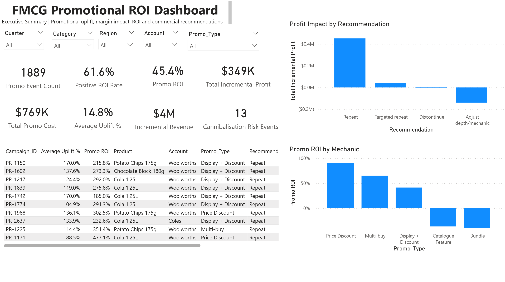
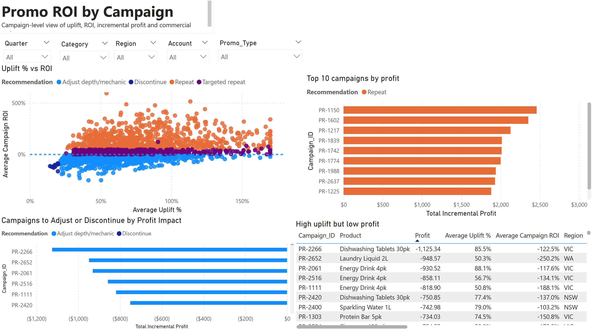
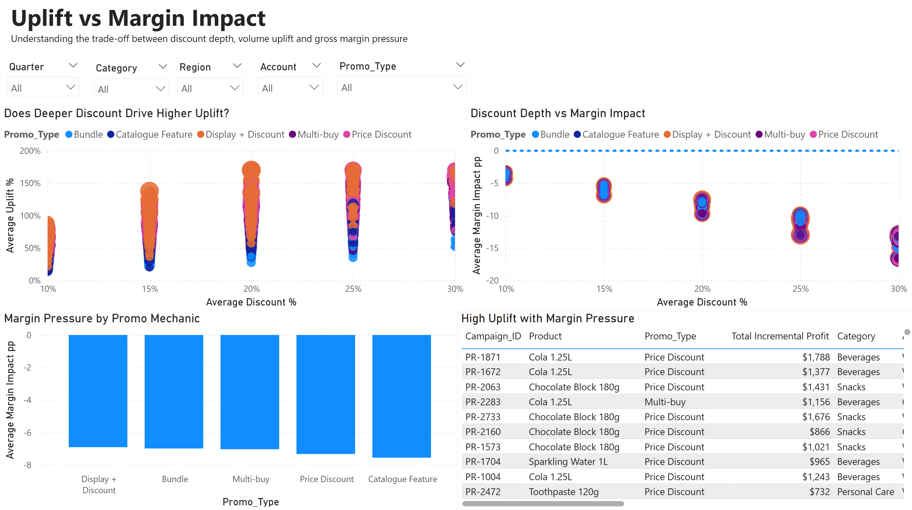
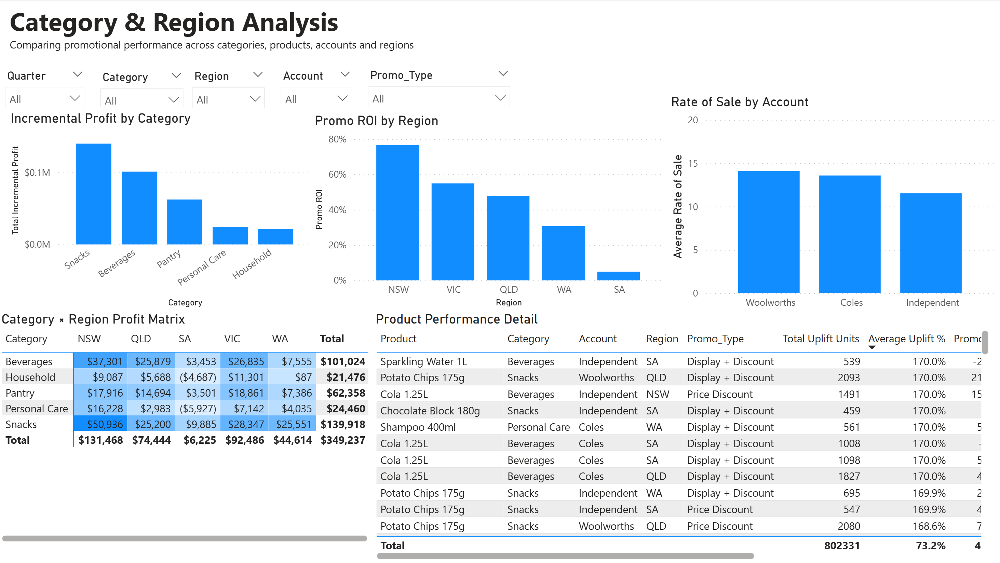
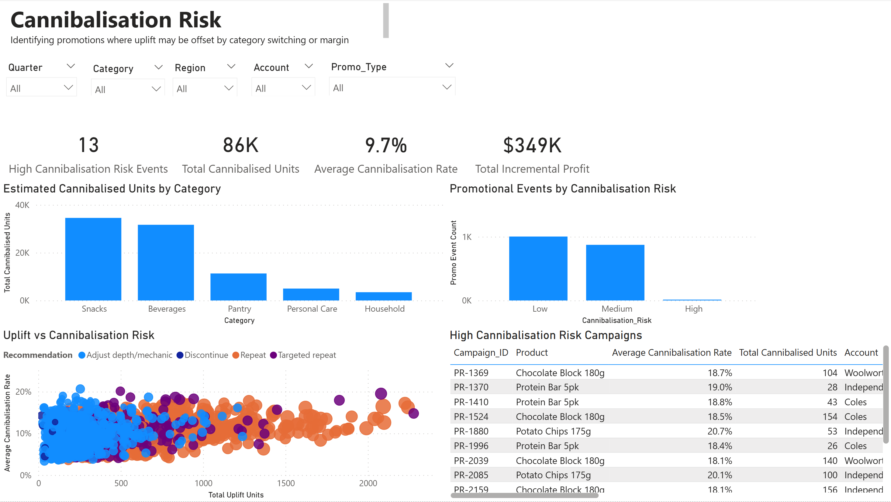

# FMCG Promotional ROI Case Study — Excel / Power BI / Python

## Project Overview

This project is a simulated FMCG commercial analytics case study designed to evaluate whether retail promotions generated profitable incremental growth.

The analysis focuses on promotional ROI, baseline sales, actual vs expected sales, uplift %, gross margin impact, promotional cost, incremental profit, rate of sale, and cannibalisation risk.

The project is designed from the perspective of a data analyst supporting account managers, sales teams, category teams, buyers, and senior stakeholders in promotional review and pre-promo planning.

The core business question is:

**Which retail promotions created profitable incremental growth, and which should be repeated, targeted, adjusted or discontinued?**

---
## Dashboard Screenshots

### Executive Summary



### Promo ROI by Campaign



### Uplift vs Margin Impact



### Category & Region Analysis



### Cannibalisation Risk


## Business Problem

FMCG promotions often increase sales volume, but higher volume does not always mean higher profit.

A promotion may generate strong unit uplift while reducing gross margin due to discount depth, promotional funding, catalogue or display costs, and potential cannibalisation within the same category.

This project evaluates promotional performance by separating volume uplift from profit impact.

The analysis answers:

* Which promotions generated profitable uplift?
* Which campaigns increased volume but reduced profit?
* Which products, categories, regions, and accounts responded best to promotions?
* Which promotional mechanics delivered the strongest ROI?
* Which campaigns had high uplift but weak margin performance?
* Which promotions had potential cannibalisation risk?
* Which promotions should be repeated, adjusted, reviewed, or discontinued?

---

## Dataset

The dataset is synthetic and designed to reflect realistic FMCG promotional performance analysis.

Each row represents weekly product-account-region level performance.

Dataset grain:

* Week
* Product
* Category
* Brand
* Region
* Retail account
* Promotion type
* Campaign ID

Current dataset size:
- 52 weeks
- 12 products
- 5 regions
- 3 retail account groups
- 9,360 total rows
- 1,889 promotional event rows
- 61.6% positive ROI promotional events
- Median Promo ROI: 0.28
- Total Incremental Profit: $349,237

Files:

Primary dataset:

* `data/fmcg_promo_roi_synthetic_dataset_v2.csv`
* `data/fmcg_promo_roi_summary_tables_v2.csv`

Original dataset version:

* `data/fmcg_promo_roi_synthetic_dataset.csv`
* `data/fmcg_promo_roi_summary_tables.csv`

Generation script:

* `src/generate_fmcg_promo_roi_dataset_v2.py`
Analysis notebook:

* `notebooks/fmcg_promo_roi_analysis_v2.ipynb`


---

## Key Fields

The dataset includes the following commercial analytics fields:

| Field Group      | Example Fields                                                                             |
| ---------------- | ------------------------------------------------------------------------------------------ |
| Time             | Week_Start, Week_Number                                                                    |
| Product          | Product, Category, Brand                                                                   |
| Account / Region | Account, Region, Store_Count                                                               |
| Promotion        | Campaign_ID, Promo_Flag, Promo_Type, Discount_Pct                                          |
| Price / Cost     | Regular_Price, Promo_Price, Unit_Cost, Selling_Price                                       |
| Volume           | Baseline_Units, Actual_Units, Uplift_Units, Uplift_Pct                                     |
| Revenue          | Baseline_Revenue, Actual_Revenue, Incremental_Revenue_From_Uplift                          |
| Profit           | Baseline_Gross_Profit, Gross_Profit_Before_Promo_Cost, Incremental_Profit_After_Promo_Cost |
| ROI              | Promo_Cost, Promo_ROI                                                                      |
| Risk / Action    | Cannibalisation_Risk, Recommendation                                                       |

Full field definitions are available in:

* `docs/data_dictionary.md`
* `docs/metric_definitions.md`

---

## Key Metrics

### Uplift Units

`Uplift Units = Actual Units - Baseline Units`

Measures the additional units sold above expected baseline sales.

### Uplift %

`Uplift % = Uplift Units / Baseline Units`

Measures promotional volume response relative to expected baseline sales.

### Baseline Revenue

`Baseline Revenue = Baseline Units × Regular Price`

Estimates expected revenue without promotion.

### Actual Revenue

`Actual Revenue = Actual Units × Selling Price`

Measures actual revenue during the sales period.

### Incremental Revenue from Uplift

`Incremental Revenue from Uplift = max(Uplift Units, 0) × Selling Price`

Measures revenue generated from incremental units.

### Baseline Gross Profit

`Baseline Gross Profit = Baseline Units × (Regular Price - Unit Cost)`

Estimates expected gross profit without promotion.

### Gross Profit Before Promo Cost

`Gross Profit Before Promo Cost = Actual Units × (Selling Price - Unit Cost)`

Measures gross profit during the promotional period before deducting promotional investment.

### Incremental Gross Profit Before Cost

`Incremental Gross Profit Before Cost = Gross Profit Before Promo Cost - Baseline Gross Profit`

Measures gross profit impact before promotional cost.

### Incremental Profit After Promo Cost

`Incremental Profit After Promo Cost = Incremental Gross Profit Before Cost - Promo Cost`

Measures whether the promotion generated profit after accounting for margin impact and promotional investment.

### Promo ROI

`Promo ROI = Incremental Profit After Promo Cost / Promo Cost`

Measures net incremental profit generated for each dollar of promotional spend.

### Rate of Sale

`Rate of Sale = Actual Units / Store Count`

Measures units sold per store per week.

### Cannibalised Units Estimate

`Cannibalised Units Estimate = Uplift Units × Cannibalisation Rate Estimate`

Estimates the portion of uplift potentially taken from other products in the same category.

---

## Methodology

The project follows a commercial analytics workflow:

1. Generate a synthetic FMCG promotional sales dataset.
2. Estimate baseline sales for each product, account, region, and week.
3. Compare actual sales against expected baseline sales.
4. Calculate uplift units and uplift percentage.
5. Calculate revenue impact, gross margin impact, promotional cost, incremental profit, and ROI.
6. Estimate cannibalisation risk.
7. Rank promotional campaigns by commercial performance.
8. Classify campaigns into business action groups.
9. Design an Excel / Power BI dashboard structure for stakeholder reporting.
10. Translate analysis outputs into account-manager-facing recommendations.

---
## Analysis Results

The v2 dataset was calibrated to create a realistic mix of successful, marginal, and underperforming promotional campaigns.

Headline results:

| Metric                                    |   Result |
| ----------------------------------------- | -------: |
| Total rows                                |    9,360 |
| Promotional event rows                    |    1,889 |
| Positive ROI promotional events           |    61.6% |
| Median Promo ROI                          |     0.28 |
| Total incremental profit after promo cost | $349,237 |

Recommendation split:

| Recommendation        | Promotional Events |
| --------------------- | -----------------: |
| Repeat                |                786 |
| Targeted repeat       |                377 |
| Adjust depth/mechanic |                715 |
| Discontinue           |                 11 |

These results show that not every promotion should be treated the same. Some campaigns generated profitable uplift and should be repeated, while others increased sales volume but require adjustment because promotional cost and margin impact reduced commercial return.

## Recommendation Logic

Promotions are classified into commercial action groups:

| Recommendation        | Interpretation                                                               |
| --------------------- | ---------------------------------------------------------------------------- |
| Repeat                | Strong ROI, positive incremental profit, and manageable cannibalisation risk |
| Targeted repeat       | Positive performance in selected products, regions, or accounts              |
| Adjust depth/mechanic | Strong uplift but weak profit due to discount depth or promotional cost      |
| Review                | Mixed performance requiring additional commercial context                    |
| Discontinue           | Negative ROI or insufficient commercial return                               |

The key commercial principle is:

**A promotion should not be judged by sales uplift alone. It should be judged by whether it generated profitable incremental growth after margin impact and promotional cost.**

---

## Power BI Dashboard Design

The dashboard is designed for Excel / Power BI reporting.

### Page 1: Executive Summary

Key KPIs:

* Total actual revenue
* Total incremental revenue
* Total promotional cost
* Total incremental profit
* Median promotional ROI
* Average uplift %
* Positive ROI promotion rate
* High cannibalisation risk count

Dashboard pages and visuals include:

* KPI cards
* Incremental profit by recommendation
* Promo ROI by promo type
* Top and bottom campaigns by incremental profit

---

### Page 2: Promo ROI by Campaign

Purpose:

Identify which campaigns generated the strongest commercial return.

Suggested visuals:

* Uplift % vs Promo ROI scatter plot
* Top 10 campaigns by incremental profit
* Bottom 10 campaigns by ROI
* Campaign performance table by product, account, region, and promo type

---

### Page 3: Uplift vs Margin Impact

Purpose:

Identify promotions that increased volume but damaged margin.

Suggested visuals:

* Discount % vs Uplift %
* Discount % vs Margin Impact
* Uplift Units vs Incremental Profit
* Average margin impact by promo type

---

### Page 4: Category / Product / Region Analysis

Purpose:

Compare promotional effectiveness across categories, products, accounts, and regions.

Suggested visuals:

* Incremental profit by category
* Promo ROI by region
* Rate of sale by account
* Category and region performance matrix

---

### Page 5: Cannibalisation Risk

Purpose:

Identify promotions where uplift may have come from switching within the same category.

Suggested visuals:

* Cannibalised units by category
* High-risk campaign table
* Uplift units vs cannibalisation rate
* Recommendation breakdown by cannibalisation risk

---

## Key Commercial Insights

- 61.6% of promotional events generated positive ROI, showing that a majority of promotions were commercially viable but still required prioritisation.
- Total incremental profit after promotional cost was $349,237 across 1,889 promotional event rows.
- High uplift did not always translate into strong profit; several campaigns created volume growth but underperformed after discount depth and promotional cost were considered.
- Repeat campaigns were the strongest contributors to incremental profit, while Adjust depth/mechanic campaigns showed that some promotions needed better discount control or mechanic changes.
- Cannibalisation risk was concentrated in selected categories, suggesting that uplift should be reviewed alongside category switching risk before repeating campaigns.

---

## Tools Used

* Python
* pandas
* NumPy
* matplotlib
* Excel
* Power BI
* CSV

---

## Repository Structure

```text
fmcg-promotional-roi-case-study/
│
├── README.md
├── requirements.txt
├── LICENSE
│
├── data/
│   ├── fmcg_promo_roi_synthetic_dataset_v2.csv
│   ├── fmcg_promo_roi_summary_tables_v2.csv
│   ├── fmcg_promo_roi_synthetic_dataset.csv
│   └── fmcg_promo_roi_summary_tables.csv
│
├── src/
│   └── generate_fmcg_promo_roi_dataset_v2.py
│
├── notebooks/
│   └── fmcg_promo_roi_analysis_v2.ipynb
│
├── docs/
│   ├── data_dictionary.md
│   └── metric_definitions.md
│
├── dashboard/
│   └── powerbi/
│
└── images/
    ├── ExecutiveSummary.png
    ├── PromoRoiCampaign.png
    ├── UpliftVsMarginImpact.png
    ├── CategoryRegionAnalysis.png
    └── CannibalisationRisk.png
```

## How to Run

Clone the repository:

```bash
git clone https://github.com/Codinu/fmcg-promotional-roi-case-study.git
cd fmcg-promotional-roi-case-study
```

Install dependencies:

```bash
pip install -r requirements.txt
```

Generate the synthetic dataset:

```bash
python src/generate_fmcg_promo_roi_dataset_v2.py
```

This creates the main CSV outputs used for analysis and dashboard development:

```text
data/fmcg_promo_roi_synthetic_dataset_v2.csv
data/fmcg_promo_roi_summary_tables_v2.csv
```

Open the analysis notebook:

```text
notebooks/fmcg_promo_roi_analysis_v2.ipynb
```

The CSV outputs can be imported into Excel or Power BI for dashboard development.

---
## Project Status

Current status: Portfolio-ready case study.

Completed:

* Synthetic FMCG promotional ROI dataset
* Dataset generation script
* Data dictionary and metric definitions
* Python analysis notebook
* Power BI dashboard with five analytical pages
* Executive summary and campaign-level ROI analysis
* Uplift vs margin impact analysis
* Category, region and account performance analysis
* Cannibalisation risk analysis
* Commercial recommendation logic for Repeat, Targeted repeat, Adjust depth/mechanic and Discontinue actions

This project is designed as a portfolio case study for commercial analytics, data analyst and graduate data scientist roles.

---

## Summary

Built a simulated FMCG promotional ROI analysis using Python, Excel, and Power BI to evaluate profitable uplift, gross margin impact, promotional cost, incremental profit, ROI, rate of sale, and cannibalisation risk across products, categories, regions, accounts, and campaign types.

Designed the project to support account-manager-facing promotional review, pre-promo planning, dashboard reporting, and commercial recommendations on which promotions to repeat, adjust, review, or discontinue.

---

## Disclaimer

This project uses synthetic data created for portfolio and learning purposes. It does not contain confidential, proprietary, or real company sales data.
